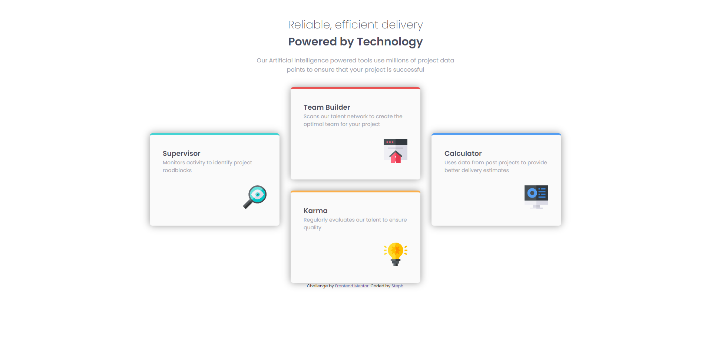

# Steph - Four card feature section solution

This is a solution to the [Four card feature section challenge on Frontend Mentor](https://www.frontendmentor.io/challenges/four-card-feature-section-weK1eFYK). 

## Overview

### Screenshot

### Links

- Solution URL: [here](https://www.frontendmentor.io/solutions/solution-four-card-feature-section-7xUg1GurW6)
- Live Site URL: [here](https://xstephx.github.io/four-card-feature-section-challenge/)

## My process

### Built with

- Semantic HTML5 markup
- CSS custom properties
- CSS Variables
- CSS Flexbox
- CSS Media Queries

# 🚀🚀🚀

